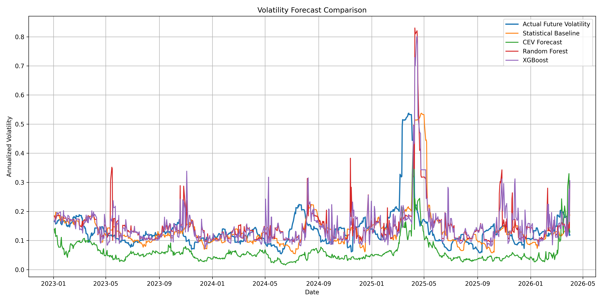
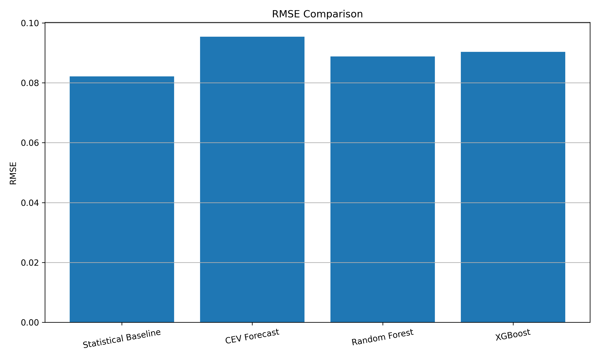

# Volatility Forecasting

A Python project comparing four approaches to forecasting short-term equity volatility using SPY (S&P 500 ETF) price data.

## Overview

This project forecasts **20-day forward realized volatility** and benchmarks four models against each other:

| Model | RMSE | MAE |
|---|---|---|
| Statistical Baseline (persistence) | 0.0821 | 0.0480 |
| Random Forest | 0.0889 | 0.0494 |
| XGBoost | 0.0903 | 0.0538 |
| CEV (Constant Elasticity of Variance) | 0.0954 | 0.0776 |

The persistence baseline — using current realized volatility as the forecast — proved difficult to beat, which is consistent with the empirical literature on short-horizon volatility forecasting.

## Models

**Statistical Baseline**  
Naive persistence model: forecasts future volatility as equal to current 20-day rolling realized volatility. Serves as the benchmark all other models must beat.

**CEV Forecast**  
Estimates rolling Constant Elasticity of Variance parameters via log-log regression of price increments on lagged price levels. Generates a vol forecast of the form `σ · S^(β−1)`, where β captures the leverage effect.

**Random Forest**  
Ensemble of 300 decision trees trained on lagged realized volatility features (`rv20` at lags 1, 5, and 10 days). Time-series split with training data up to 2023-01-01.

**XGBoost**  
Gradient-boosted trees with the same feature set as Random Forest. Uses depth-3 trees with learning rate 0.05 and subsampling for regularization.

## Project Structure

```
volatility-forecasting/
├── src/
│   ├── data_loader.py          # Downloads raw OHLCV data via yfinance
│   ├── data_preprocess.py      # Cleans and normalizes price data
│   ├── statistical_baseline.py # Rolling realized vol + persistence forecast
│   ├── cev_forecast.py         # Rolling CEV parameter estimation
│   ├── random_forest_model.py  # Random Forest training and evaluation
│   └── xgboost_model.py        # XGBoost training and evaluation
├── scripts/
│   ├── run_statistical_baseline.py
│   ├── run_cev_regression.py
│   ├── run_random_forest.py
│   ├── run_xgboost.py
│   ├── run_compare_models.py   # Runs all models and saves metrics
│   └── run_plot_model_comparison.py
├── data/
│   ├── raw/                    # Raw OHLCV CSVs from Yahoo Finance
│   ├── processed/              # Cleaned price series
│   ├── features/               # CEV feature outputs
│   └── results/                # Model comparison outputs
└── figures/                    # Saved forecast comparison plots
```

## Getting Started

**Install dependencies**

```bash
pip install pandas numpy scikit-learn xgboost yfinance matplotlib
```

**Download and preprocess data**

```bash
python src/data_loader.py
python src/data_preprocess.py
```

**Run all models and compare**

```bash
python scripts/run_compare_models.py
python scripts/run_plot_model_comparison.py
```

Or run individual models:

```bash
python scripts/run_statistical_baseline.py
python scripts/run_random_forest.py
python scripts/run_xgboost.py
```

## Data

Historical daily closing prices for SPY (S&P 500 ETF) from 2015 to present, sourced via Yahoo Finance. Realized volatility is computed as the annualized standard deviation of log returns over a 20-day rolling window.

## Key Design Decisions

- **Time-series split**: All models use a strict temporal train/test split (training data ≤ 2023-01-01) to prevent look-ahead bias.
- **Annualized volatility**: All forecasts are expressed as annualized realized volatility (scaled by √252) for comparability.
- **20-day horizon**: Chosen to balance signal-to-noise ratio and practical relevance.

## Results



